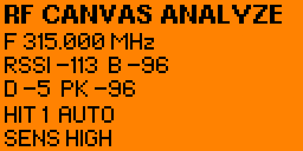
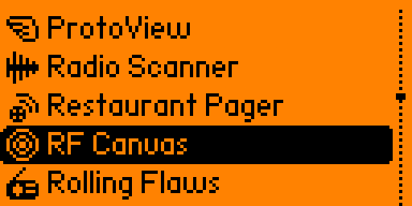
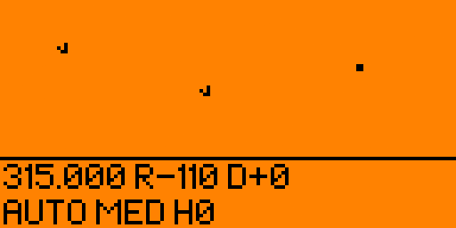
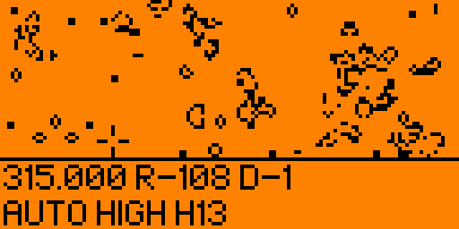

# RF Canvas v1.0

**RF Canvas** is a passive Sub-GHz RF activity analyzer and generative visualization application developed for **Flipper Zero** using C and the Momentum Firmware build environment.

The application monitors selected Sub-GHz bands, measures changes in received signal strength (RSSI), detects RF activity relative to an adaptive noise baseline, and transforms detected events into real-time **Conway's Game of Life** visual patterns.

> RF Canvas is designed as a passive RF activity visualization and analysis tool. It does not record, replay, clone, or transmit captured remote-control signals.

## Screenshots

### Analyze Mode


### App Menu


### Hybrid Mode


### RF HIT Detection


### High-Signal Generative Art


## Features

- Passive Sub-GHz RF activity monitoring
- 315.000 MHz, 433.920 MHz and 868.350 MHz scanning
- Automatic and manual frequency modes
- Adaptive RSSI baseline calibration
- RSSI, baseline, delta and peak measurements
- RF event / HIT counter
- Hysteresis-based event detection to reduce duplicate triggers
- High / Medium / Low sensitivity levels
- Temporary frequency lock after an RF event
- Signal-strength-driven generative visuals
- Conway's Game of Life visualization engine
- Analyze, Art and Hybrid interface modes
- Permanent installation as a `.fap` application on the Flipper Zero SD card
- Custom 10x10 application icon

## Modes

### Analyze
Displays technical RF information including current frequency, RSSI, adaptive baseline, RSSI delta, peak signal level, total detected RF events, Auto / Manual mode and sensitivity level.

### Art
Uses detected RF activity as input for generative Conway's Game of Life patterns. Stronger RF events create denser visual patterns.

### Hybrid
Combines the live generative visualization with compact RF analysis information.

## Controls

| Button | Function |
|---|---|
| OK | Switch between Analyze / Art / Hybrid |
| UP | Toggle Auto / Manual scanning |
| DOWN | Change sensitivity |
| LEFT | Previous frequency and enter Manual mode |
| RIGHT | Next frequency and enter Manual mode |
| BACK | Exit application |

## RF Event Detection

RF Canvas first calibrates a noise baseline for each monitored frequency. A signal is treated as an RF event when its RSSI rises above the learned baseline by the active sensitivity threshold.

| Mode | Approx. Trigger Delta |
|---|---:|
| HIGH | +8 dB |
| MED | +12 dB |
| LOW | +18 dB |

A hysteresis mechanism waits for the RF level to return near the baseline before accepting another event. This helps prevent one continuous transmission from being counted as many separate events.

## Frequencies

Current v1.0 scan set:

- 315.000 MHz
- 433.920 MHz
- 868.350 MHz

These frequencies are used for passive RF activity detection. RF Canvas does not identify the transmitting device or decode its protocol.

## Generative Visualization

Each detected RF event injects stable patterns such as gliders and blocks into a Conway's Game of Life simulation. The amount of generated content depends on the detected signal delta.

- Small RF event → light visual activity
- Medium RF event → larger pattern
- Strong RF event → dense visual burst

This allows the surrounding radio environment to become the input source for the artwork.

## Build Environment

Developed and tested with:

- Flipper Zero
- Momentum Firmware
- FBT (Flipper Build Tool)
- C
- CC1101 Sub-GHz radio
- Flipper GUI / Canvas API

## Project Structure

```text
rf-canvas/
├── README.md
├── LICENSE
├── CHANGELOG.md
├── .gitignore
├── application.fam
├── rf_canvas.c
├── rf_canvas.png
└── images/
    ├── 01-analyze-mode.png
    ├── 02-rf-canvas-menu.png
    ├── 03-hybrid-mode.png
    ├── 04-hit-detection.png
    └── 05-art-high-signal.png
```

## Build and Launch

From the Momentum Firmware root directory:

```powershell
.\fbt launch APPSRC=applications_user\rf_canvas
```

The generated FAP is installed to:

```text
/ext/apps/Sub-GHz/rf_canvas.fap
```

After installation it can be opened directly from:

```text
Apps → Sub-GHz → RF Canvas
```

without requiring a computer connection.

## Safety / Scope

RF Canvas is intended for passive spectrum activity observation, education, experimentation and generative visualization.

The project does not implement signal replay, rolling-code attacks, credential extraction, device impersonation or protocol cloning.

## Changelog

Release history is documented in [`CHANGELOG.md`](CHANGELOG.md).

## License

This project is licensed under the **MIT License**. See [`LICENSE`](LICENSE) for details.

## Version

**RF Canvas v1.0.0 Stable**

Initial stable release combining passive Sub-GHz RF analysis with real-time generative visualization.
